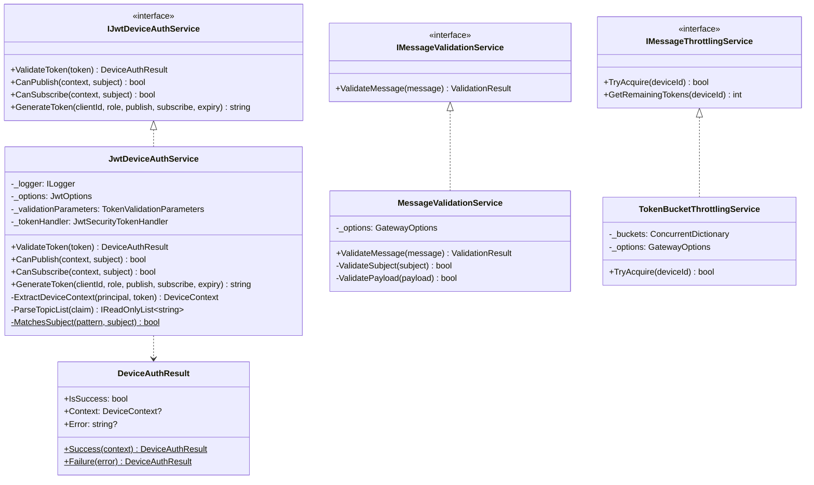
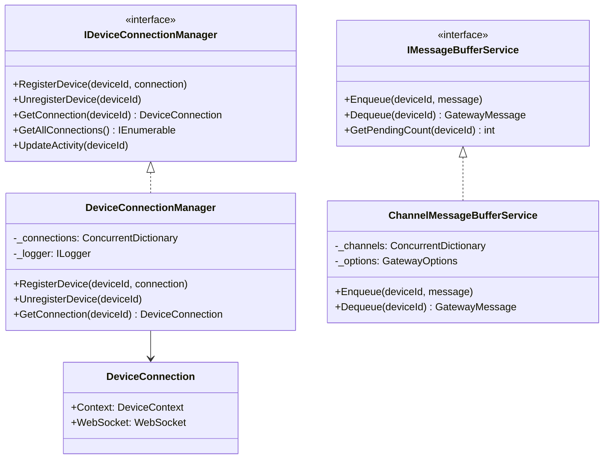
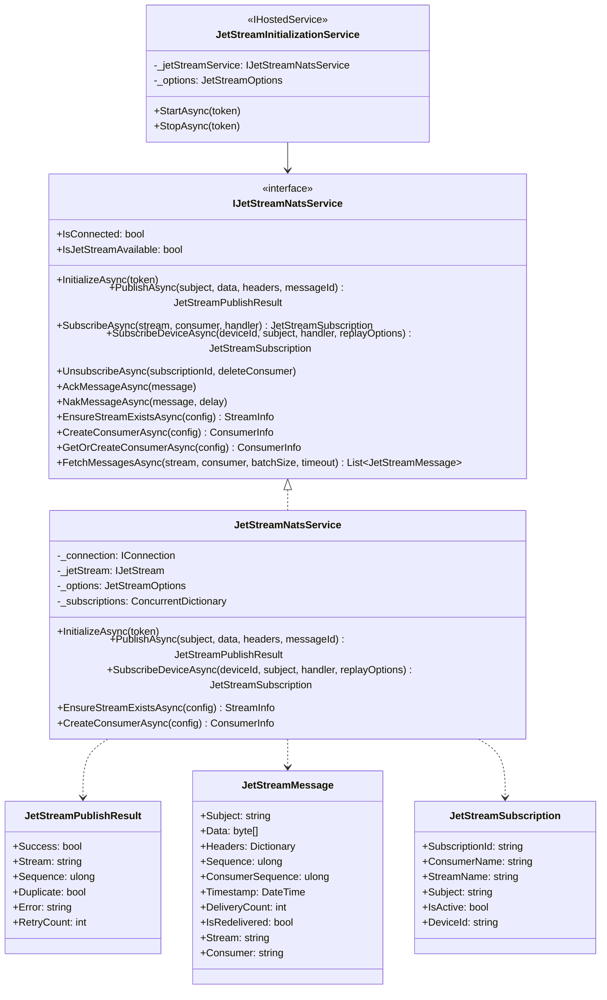
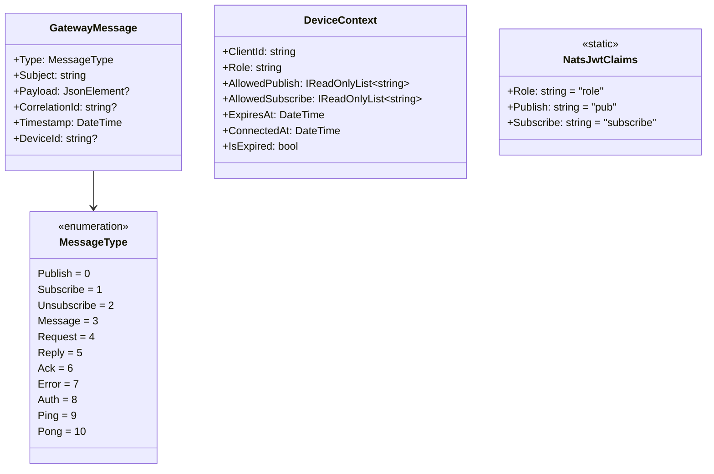
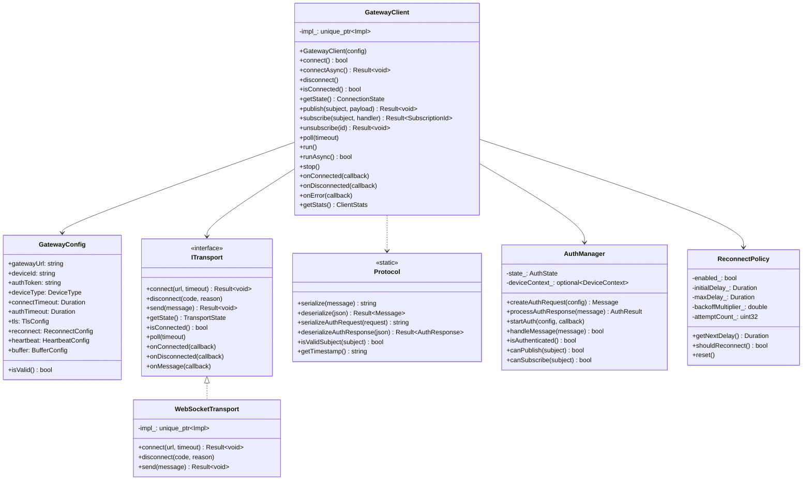
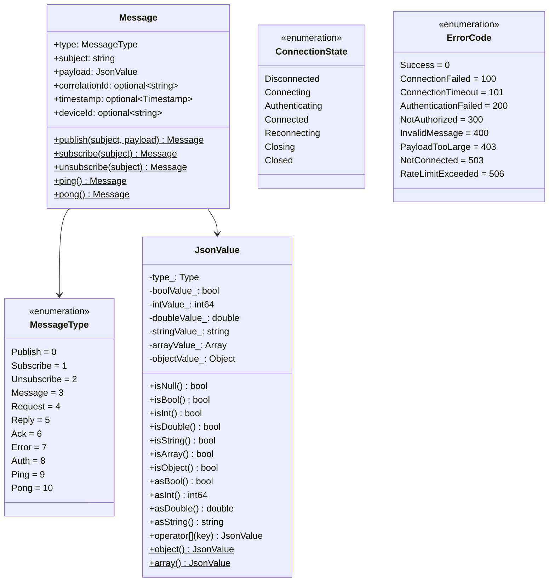
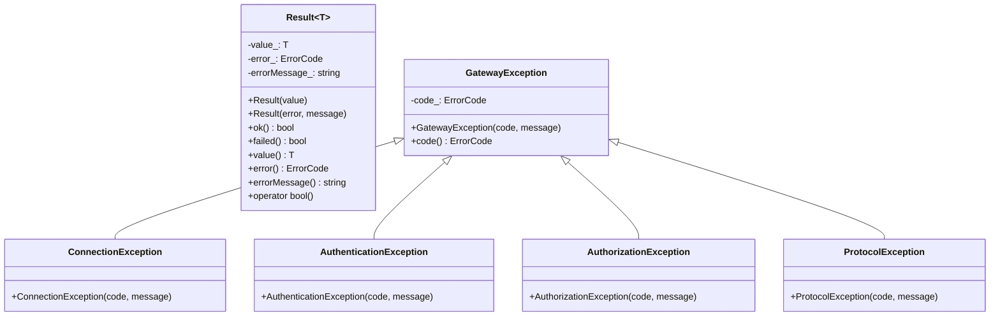
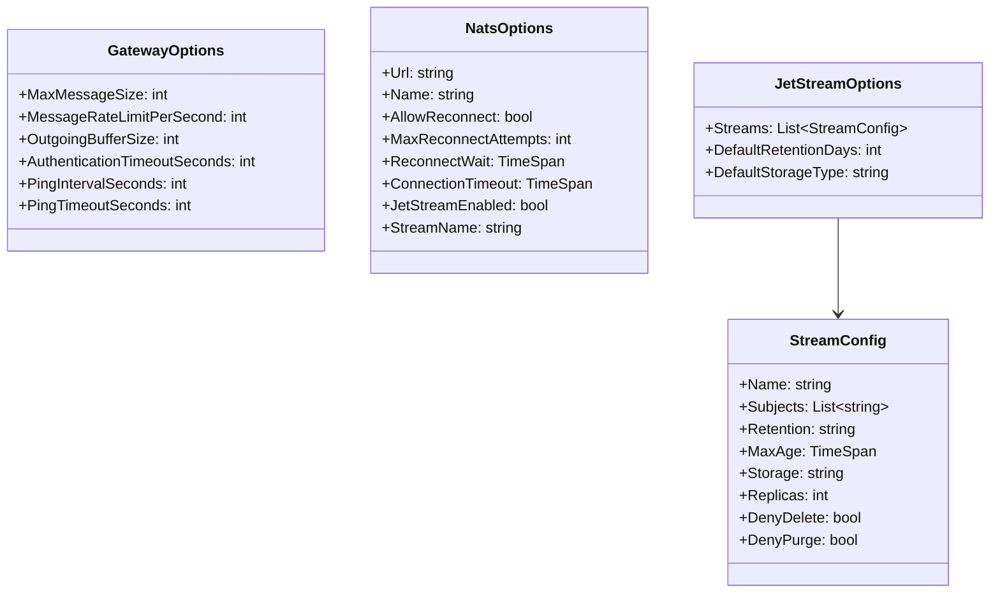
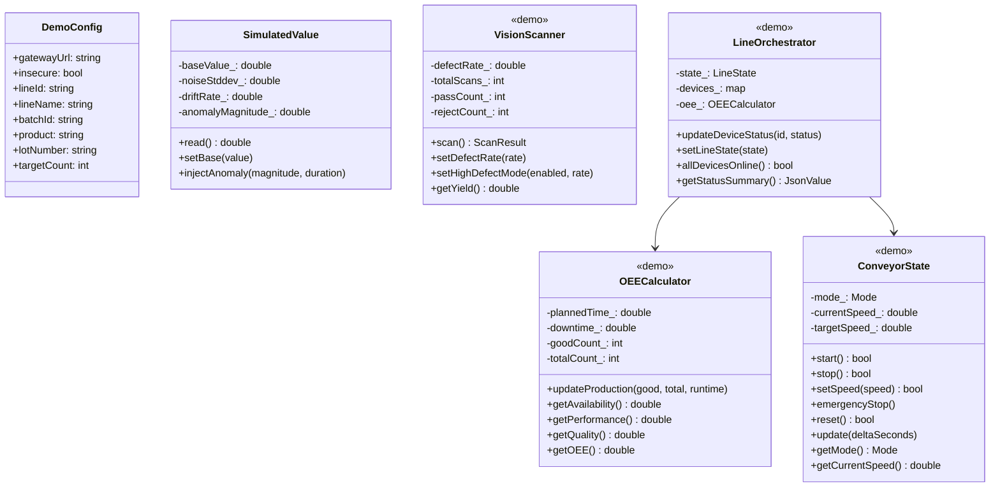

# Class Diagrams

## 1. Gateway Services

## 2. Connection Management

## 3. NATS Services

## 4. Message Models

## 5. C++ SDK Classes

## 6. SDK Message Types

## 7. SDK Result Types

## 8. Configuration Classes

## 9. Demo Device Classes

