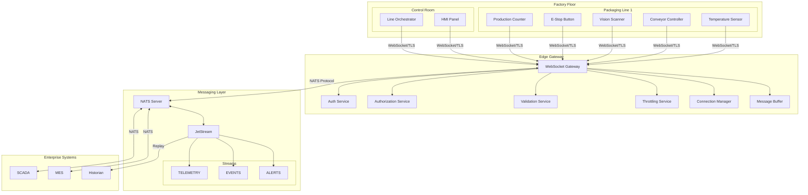
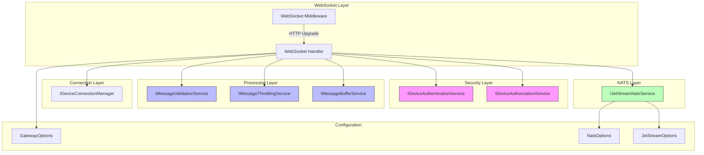
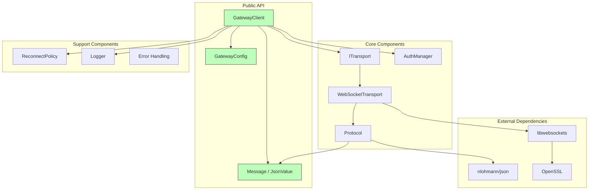
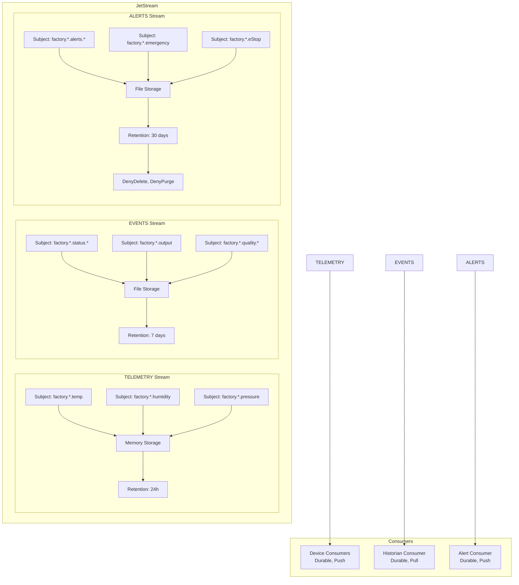
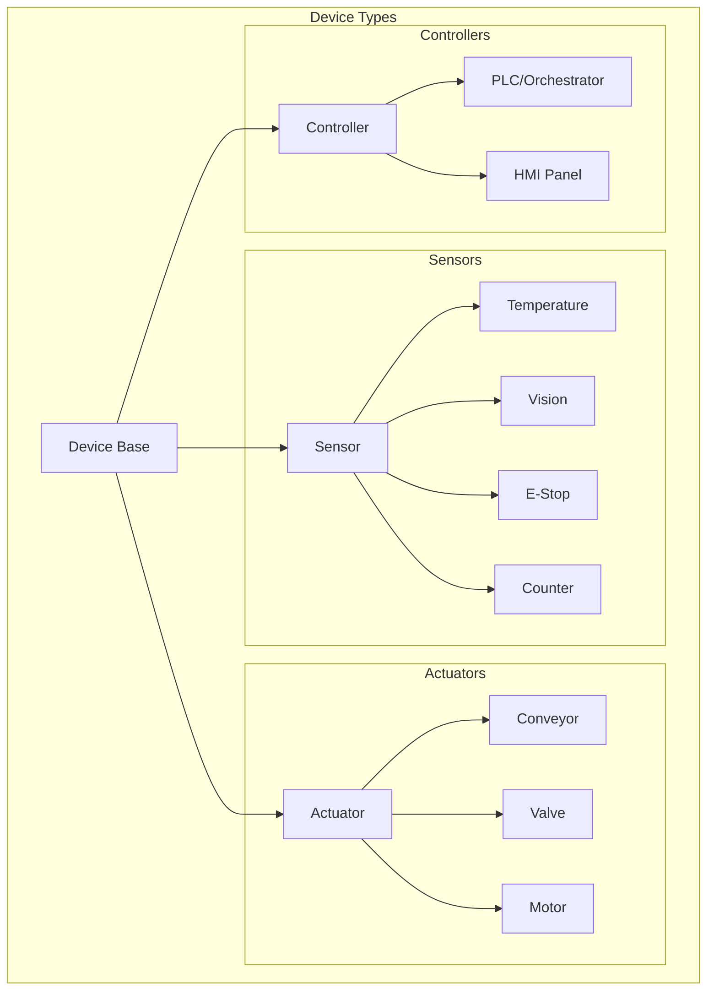
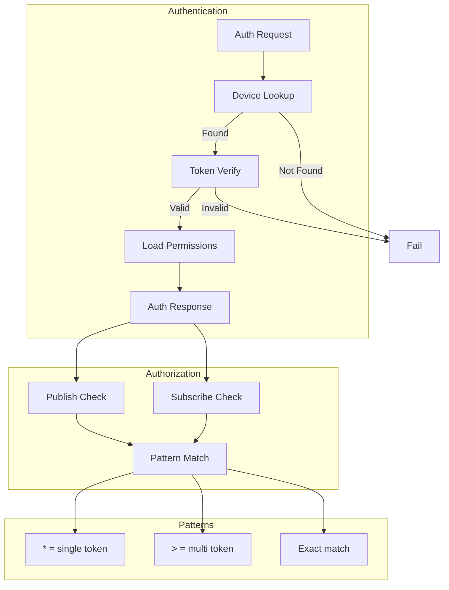
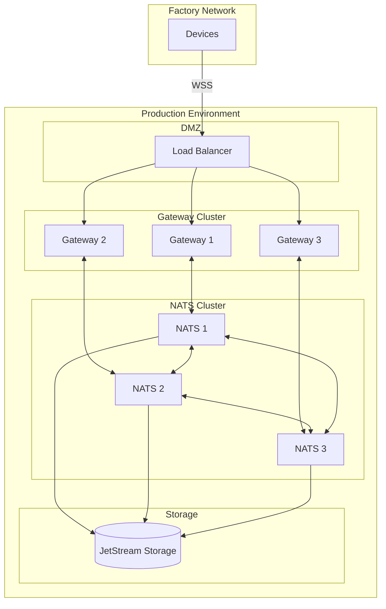

# Component Diagrams

## 1. System Architecture Overview



## 2. Gateway Internal Components



## 3. C++ SDK Components



## 4. Message Flow Component View

```mermaid
graph LR
    subgraph "Device"
        APP[Application]
        SDK[SDK Client]
    end

    subgraph "Transport"
        WS[WebSocket]
        TLS[TLS]
    end

    subgraph "Gateway"
        RECV[Receiver]
        PROC[Processor]
        SEND[Sender]
    end

    subgraph "NATS"
        PUB[Publisher]
        SUB[Subscriber]
        STR[Stream]
    end

    APP -->|publish()| SDK
    SDK -->|JSON| WS
    WS -->|Encrypted| TLS
    TLS -->|TCP| RECV

    RECV -->|Parse| PROC
    PROC -->|Validate| PROC
    PROC -->|Authorize| PROC
    PROC -->|Publish| PUB

    PUB --> STR
    STR --> SUB
    SUB --> SEND

    SEND -->|Route| WS
    WS --> SDK
    SDK -->|callback| APP
```

## 5. JetStream Streams Configuration



## 6. Device Type Hierarchy



## 7. Authentication & Authorization Flow



## 8. Deployment View


