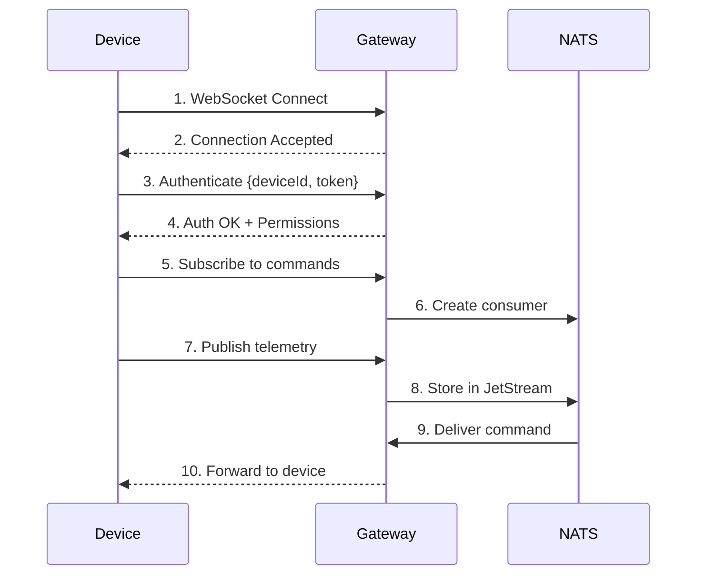
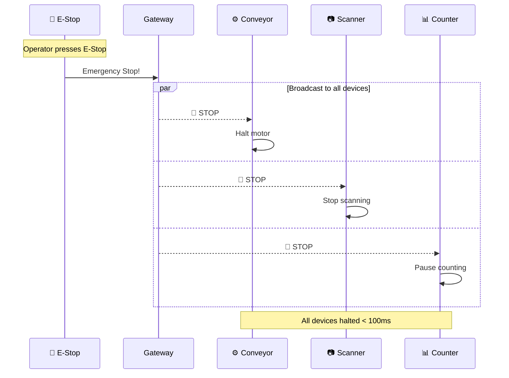
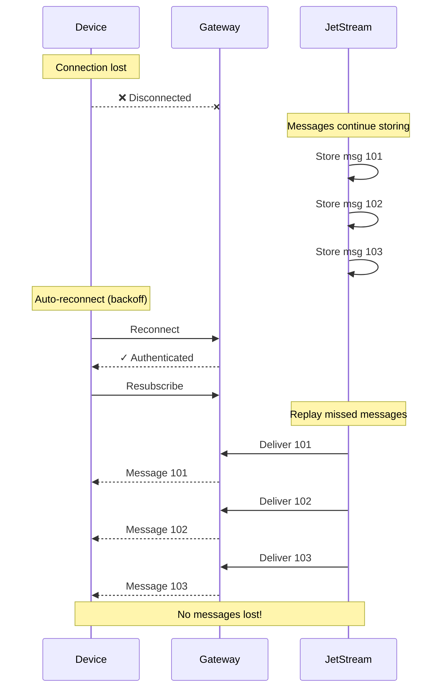
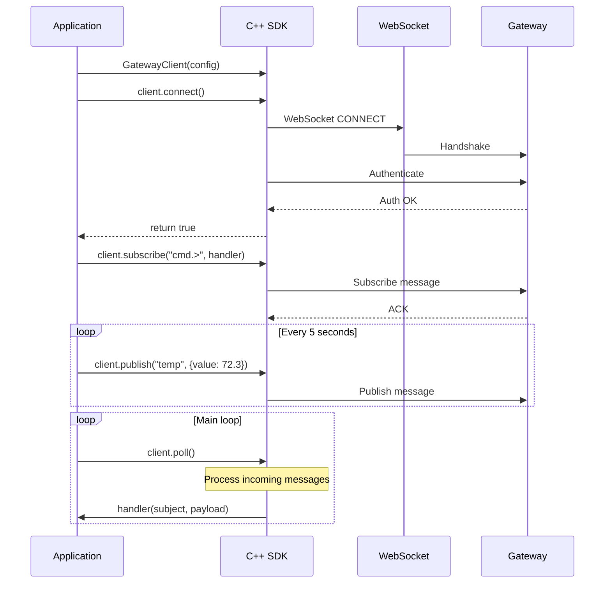
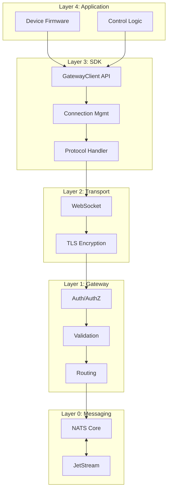
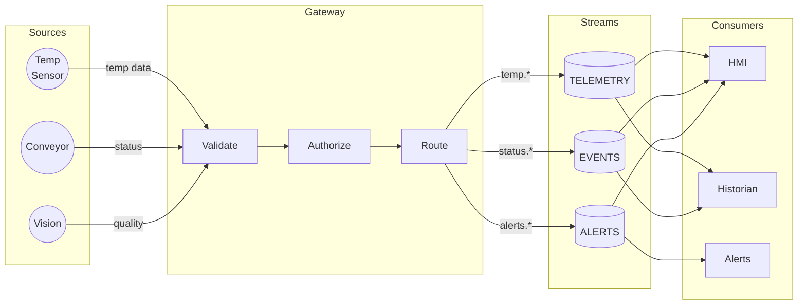
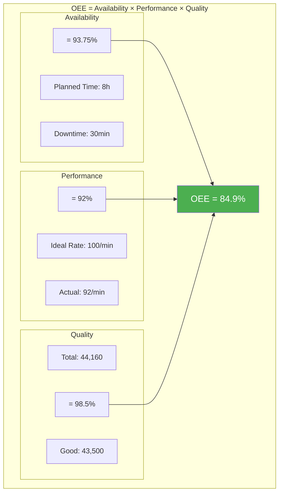
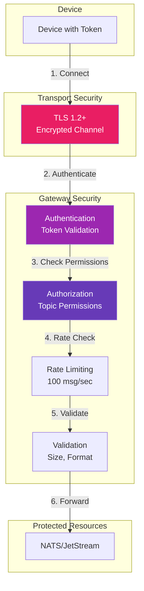

# Presentation Diagrams

Key diagrams optimized for presentations and documentation.

## 1. System Overview (High-Level)

```mermaid
graph TB
    subgraph "Factory Floor Devices"
        D1[🌡️ Temperature<br/>Sensors]
        D2[⚙️ Conveyor<br/>Controllers]
        D3[📷 Vision<br/>Scanners]
        D4[🛑 E-Stop<br/>Buttons]
        D5[📊 Production<br/>Counters]
    end

    subgraph "Gateway Layer"
        GW[🔌 WebSocket Gateway<br/>Authentication | Authorization<br/>Validation | Rate Limiting]
    end

    subgraph "Messaging Layer"
        NATS[📬 NATS + JetStream<br/>Persistence | Replay<br/>Fan-out | Durability]
    end

    subgraph "Enterprise Systems"
        E1[📺 HMI/SCADA]
        E2[🏭 MES]
        E3[📈 Historian]
    end

    D1 & D2 & D3 & D4 & D5 -->|WebSocket + TLS| GW
    GW <-->|NATS Protocol| NATS
    NATS <--> E1 & E2 & E3

    style GW fill:#4CAF50,color:white
    style NATS fill:#2196F3,color:white
```

## 2. Connection Flow (Simplified)



## 3. Emergency Stop Broadcast



## 4. Reconnection with Replay



## 5. SDK Usage (Code-Like Sequence)



## 6. Architecture Layers



## 7. Data Flow Diagram



## 8. OEE Dashboard



## 9. Security Model



## 10. Demo Scenario Timeline

```mermaid
gantt
    title Packaging Line Demo Scenario
    dateFormat HH:mm
    axisFormat %H:%M

    section Setup
    Start Gateway           :a1, 00:00, 1m
    Start Devices           :a2, after a1, 1m
    All Connected           :milestone, after a2, 0m

    section Production
    Start Line              :b1, after a2, 1m
    Normal Operation        :b2, after b1, 3m

    section Demo 1: Telemetry
    Show Temp Readings      :c1, after b2, 2m
    Show Quality Stats      :c2, after c1, 2m

    section Demo 2: Alerts
    Inject Temp Spike       :d1, after c2, 1m
    Alert Triggers          :milestone, after d1, 0m
    Return to Normal        :d2, after d1, 2m

    section Demo 3: Emergency
    Trigger E-Stop          :e1, after d2, 30s
    All Devices Stop        :milestone, after e1, 0m
    Reset E-Stop            :e2, after e1, 1m

    section Demo 4: Resilience
    Kill Conveyor           :f1, after e2, 30s
    Reconnect               :f2, after f1, 1m
    State Replayed          :milestone, after f2, 0m

    section Wrap Up
    Show OEE Stats          :g1, after f2, 2m
    Stop Line               :g2, after g1, 1m
```


