# Sequence Diagrams

## 1. Connection & Authentication

### 1.1 Successful Connection Flow

### 1.2 Failed Authentication

### 1.3 Authentication Timeout

---

## 2. Publish Flow

### 2.1 Successful Publish to JetStream

### 2.2 Publish Denied - Not Authorized

### 2.3 Publish Denied - Rate Limited

---

## 3. Subscribe Flow

### 3.1 Successful Subscription

### 3.2 Wildcard Subscription

### 3.3 Unsubscribe

---

## 4. Emergency Broadcast (Fan-out)

### 4.1 E-Stop Broadcast to All Devices

---

## 5. Reconnection Flow

### 5.1 Device Reconnection with State Replay

### 5.2 Gateway Restart - Consumer Resume

---

## 6. Request/Reply Pattern

### 6.1 Command with Response

---

## 7. Complete Production Scenario

### 7.1 Start Line Sequence

### 7.2 Alert Escalation Flow

```mermaid
sequenceDiagram
    autonumber
    participant Temp as Temp Sensor
    participant GW as Gateway
    participant JS as JetStream
    participant Orch as Orchestrator
    participant HMI as HMI Panel

    Temp->>Temp: Read temperature: 76°F

    Note over Temp: Exceeds warning threshold (75°F)

    Temp->>GW: Telemetry: {"value": 76, "status": "warning"}
    GW->>JS: Store in TELEMETRY stream

    Temp->>GW: Alert: {"severity": "warning", "type": "temperature_high", "value": 76}
    GW->>JS: Store in ALERTS stream

    JS->>GW: Deliver to Orch
    GW-->>Orch: Warning alert
    Orch->>Orch: Log alert, start escalation timer

    JS->>GW: Deliver to HMI
    GW-->>HMI: Warning alert
    HMI->>HMI: Display warning indicator

    Note over Temp: Temperature continues rising...

    Temp->>Temp: Read temperature: 81°F

    Note over Temp: Exceeds critical threshold (80°F)

    Temp->>GW: Alert: {"severity": "critical", "type": "temperature_high", "value": 81}
    GW->>JS: Store

    JS->>GW: Deliver to Orch
    GW-->>Orch: Critical alert
    Orch->>Orch: Initiate line slowdown

    Orch->>GW: Cmd: setSpeed(50) to conveyor
    GW-->>GW: Route to conveyor

    JS->>GW: Deliver to HMI
    GW-->>HMI: Critical alert
    HMI->>HMI: Display critical alarm, audible alert
```

---

## 8. Message Flow Summary

