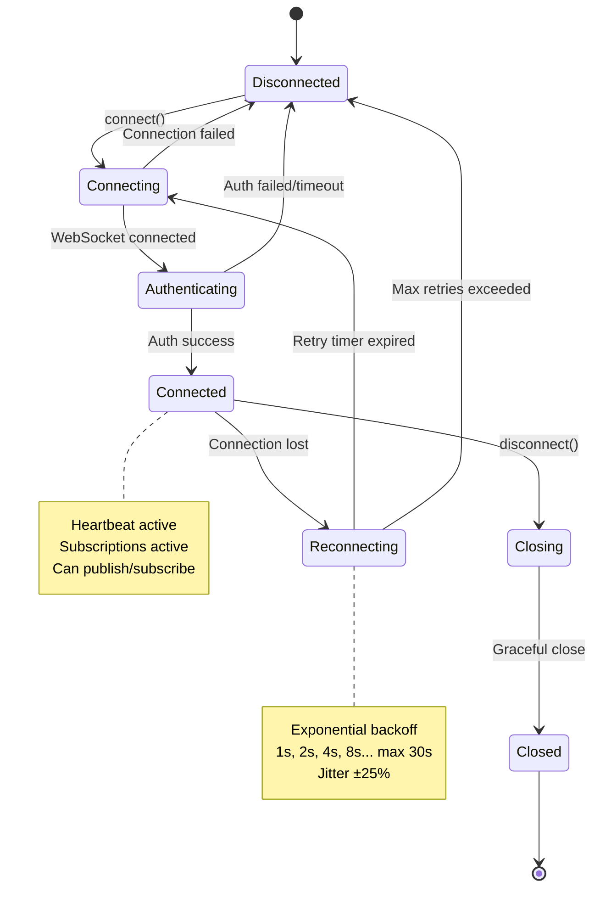
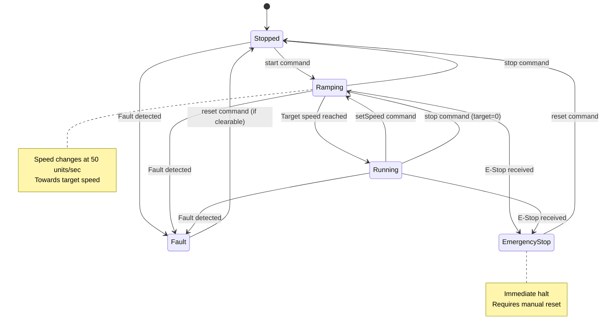
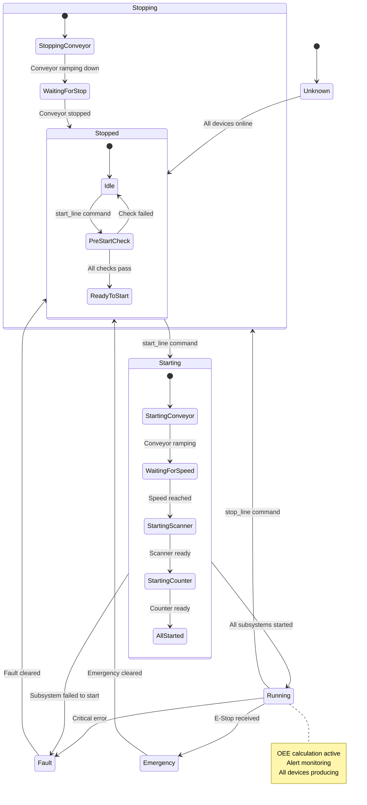
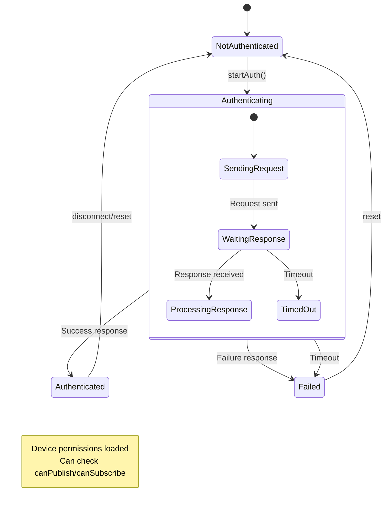
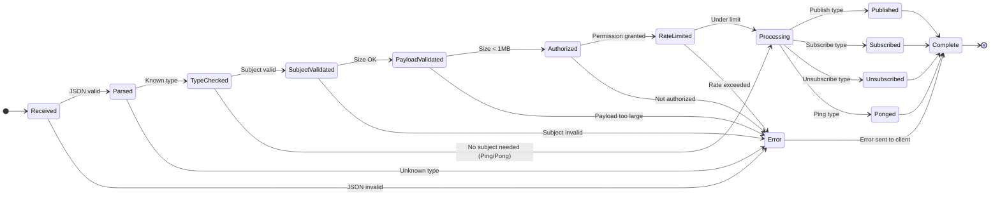
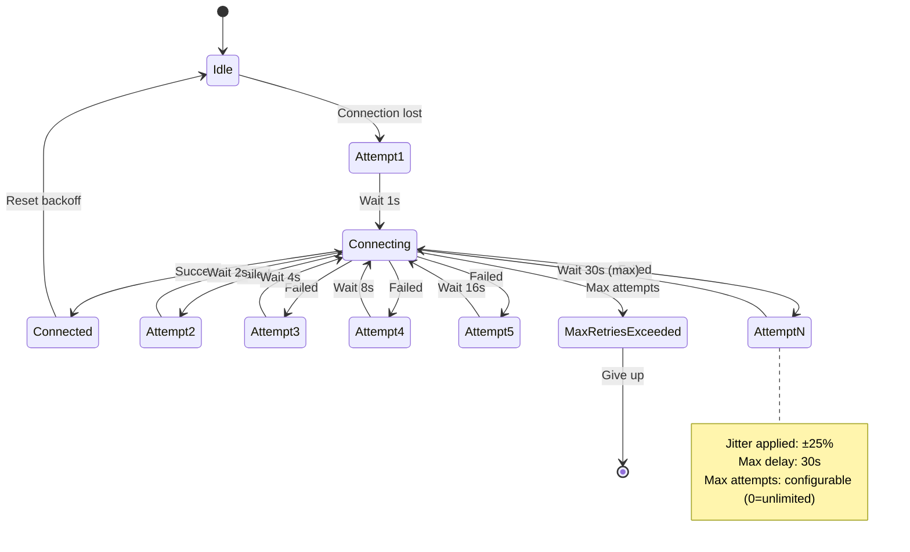
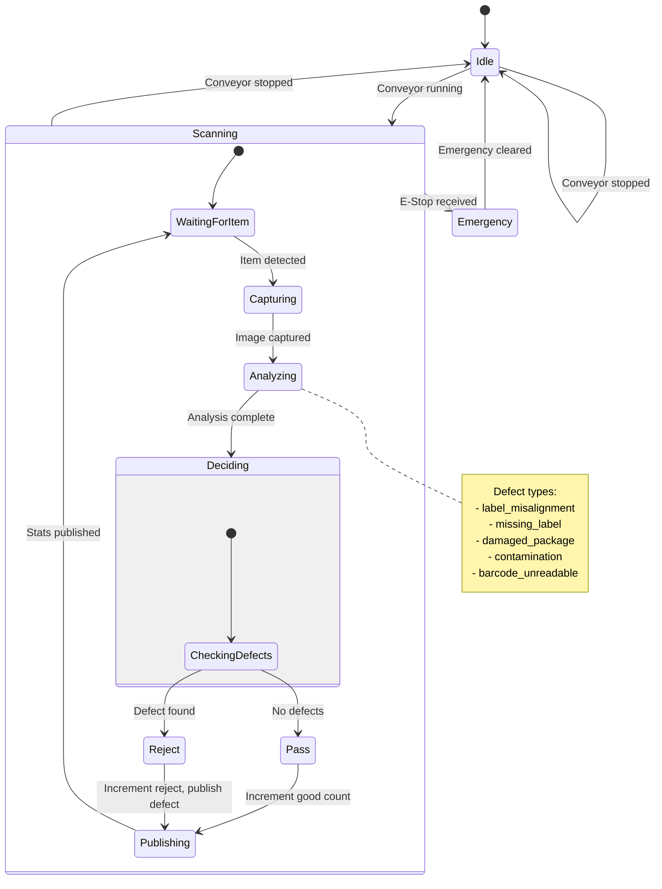
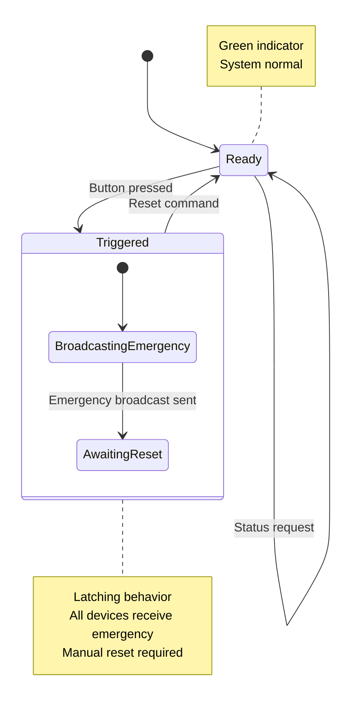
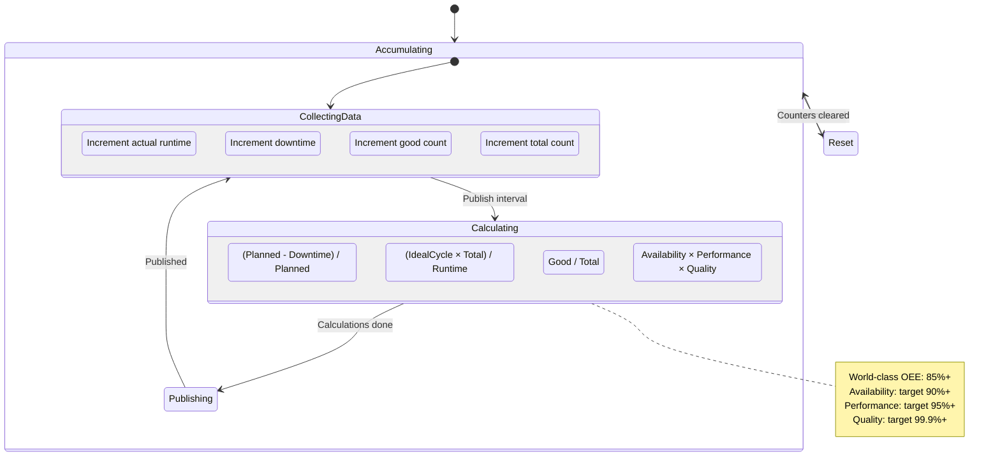

# State Diagrams

## 1. Connection State Machine (SDK)



## 2. WebSocket Handler State Machine (Gateway)

```mermaid
stateDiagram-v2
    [*] --> Accepted

    Accepted --> WaitingForAuth: Start auth timer
    WaitingForAuth --> Authenticated: Valid auth message
    WaitingForAuth --> Closed: Auth timeout (30s)
    WaitingForAuth --> Closed: Invalid credentials

    Authenticated --> Processing: Ready for messages

    state Processing {
        [*] --> Idle
        Idle --> ReceivingMessage: Message received
        ReceivingMessage --> Validating: Parse success
        ReceivingMessage --> Idle: Parse error (send error)

        Validating --> Authorizing: Valid message
        Validating --> Idle: Invalid (send error)

        Authorizing --> Executing: Authorized
        Authorizing --> Idle: Not authorized (send error)

        Executing --> Publishing: Publish message
        Executing --> Subscribing: Subscribe message
        Executing --> Unsubscribing: Unsubscribe message
        Executing --> Ponging: Ping message

        Publishing --> Idle: Published
        Subscribing --> Idle: Subscribed (send ack)
        Unsubscribing --> Idle: Unsubscribed
        Ponging --> Idle: Pong sent
    end

    Processing --> Closing: Client disconnect
    Processing --> Closing: Error/timeout

    Closing --> Closed: Cleanup complete
    Closed --> [*]
```

## 3. Conveyor Controller State Machine



## 4. Line Orchestrator State Machine



## 5. Authentication State Machine



## 6. Message Processing Pipeline



## 7. Reconnection Backoff State Machine



## 8. Quality Scanner State Machine



## 9. E-Stop Button State Machine



## 10. OEE Calculation State


