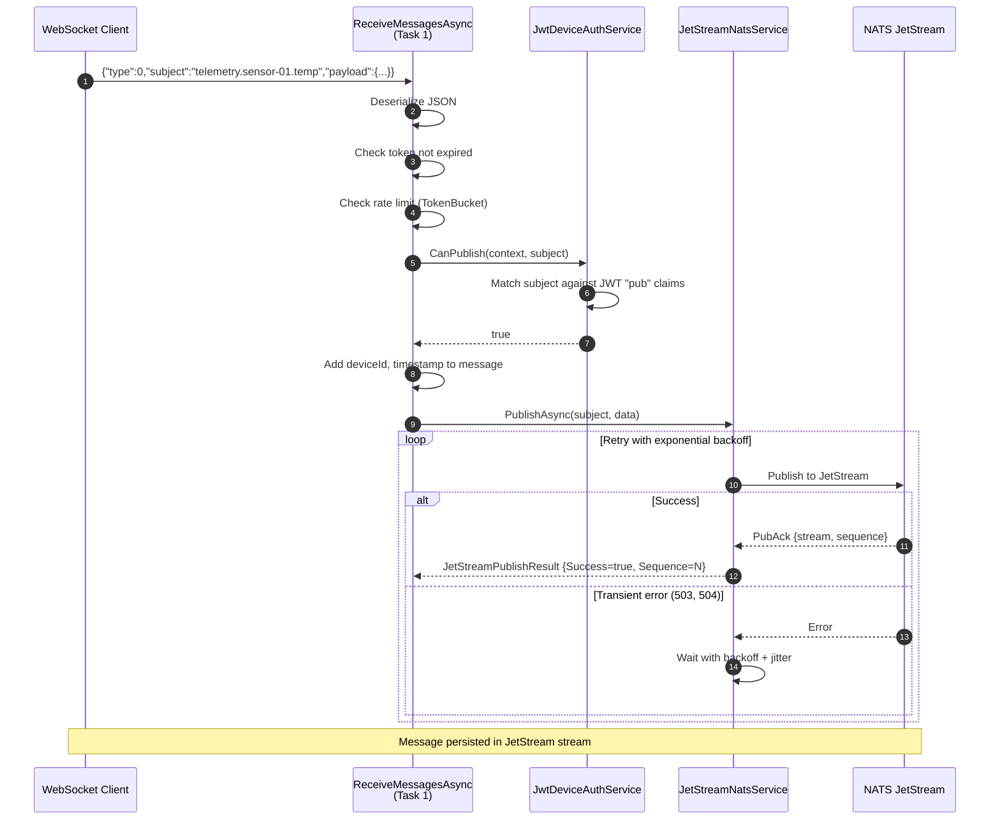
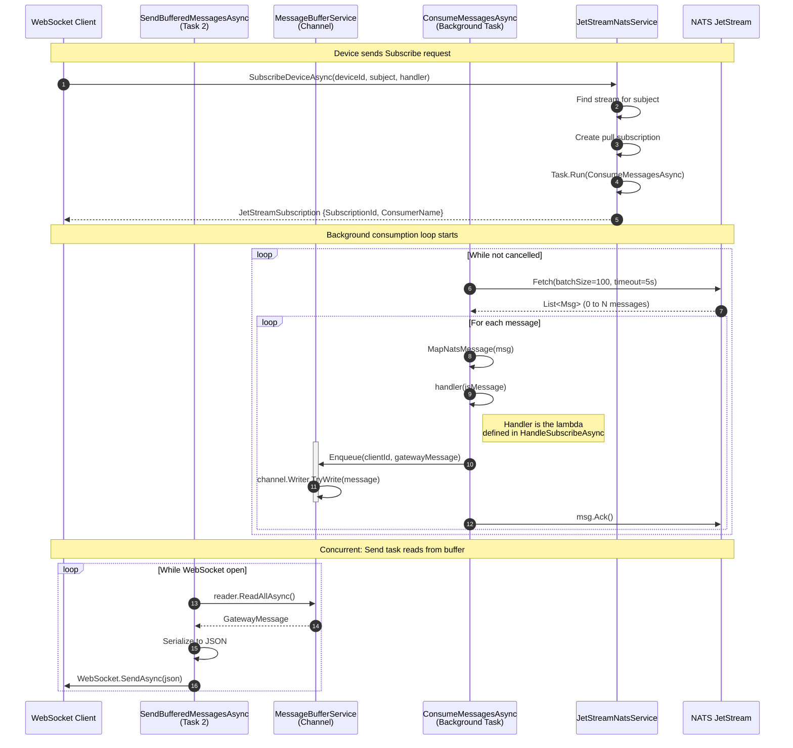
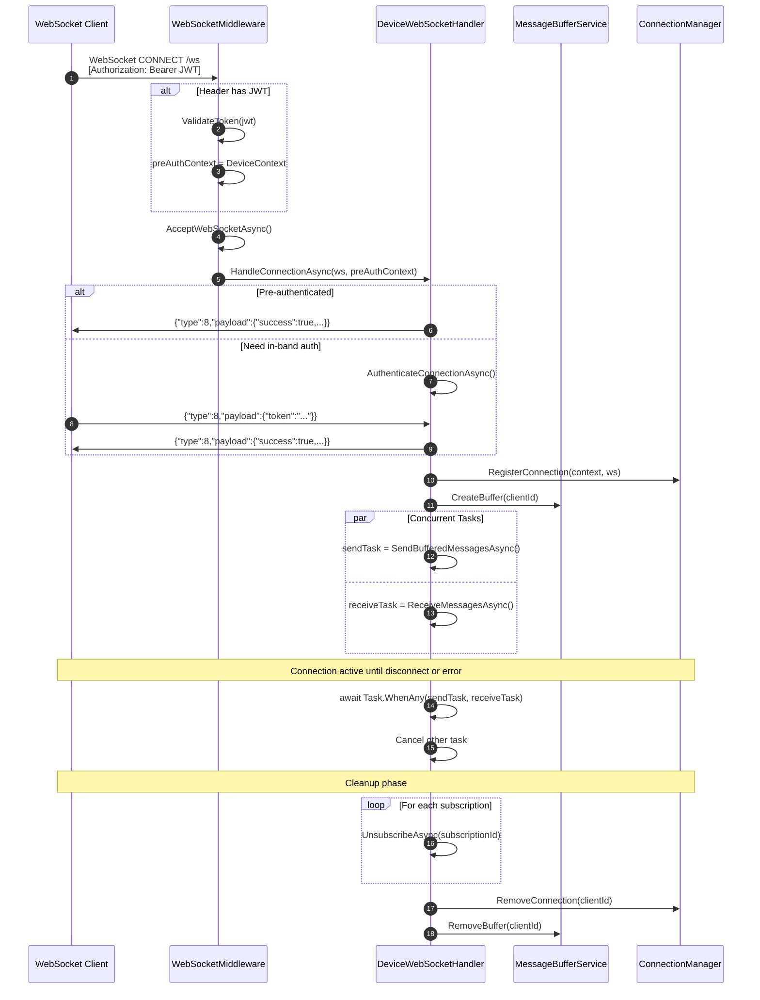

# WebSocket Message Flow Architecture

This document provides a detailed technical description of how messages flow through the NATS WebSocket Bridge gateway, from NATS JetStream to WebSocket clients and vice versa.

## Overview

The gateway uses a multi-threaded architecture with channel-based backpressure to efficiently handle message flow between NATS JetStream and WebSocket clients. Key design principles:

- **Pull-based consumption** from JetStream (not push) for flow control
- **Per-device message buffers** using `System.Threading.Channels`
- **Concurrent send/receive tasks** per WebSocket connection
- **Explicit acknowledgment** after successful processing

## Component Architecture

```
┌─────────────────────────────────────────────────────────────────────────────┐
│                              Gateway Process                                 │
├─────────────────────────────────────────────────────────────────────────────┤
│                                                                             │
│  ┌─────────────────────────────────────────────────────────────────────┐   │
│  │                    DeviceWebSocketHandler                            │   │
│  │                    (one instance per connection)                     │   │
│  │  ┌─────────────────────┐     ┌─────────────────────┐                │   │
│  │  │ ReceiveMessagesAsync│     │SendBufferedMessages │                │   │
│  │  │    (Task 1)         │     │    Async (Task 2)   │                │   │
│  │  │                     │     │                     │                │   │
│  │  │ Reads from WS ──────┼─────┼──► Writes to WS     │                │   │
│  │  │ Handles Publish,    │     │    from Channel     │                │   │
│  │  │ Subscribe, Ping     │     │                     │                │   │
│  │  └──────────┬──────────┘     └──────────▲──────────┘                │   │
│  │             │                           │                            │   │
│  └─────────────┼───────────────────────────┼────────────────────────────┘   │
│                │                           │                                │
│                │ Subscribe                 │ ReadAllAsync()                 │
│                ▼                           │                                │
│  ┌─────────────────────────┐    ┌─────────┴─────────┐                      │
│  │  JetStreamNatsService   │    │ MessageBufferService│                     │
│  │                         │    │                     │                     │
│  │  SubscribeDeviceAsync() │    │ Channel<Message>    │                     │
│  │         │               │    │   per device        │                     │
│  │         ▼               │    │                     │                     │
│  │  ConsumeMessagesAsync() │    │ Enqueue() ◄─────────┼─── Handler callback │
│  │    (Background Task)    │────┼─────────────────────┘                     │
│  │         │               │                                                │
│  │         │ Fetch()       │                                                │
│  └─────────┼───────────────┘                                                │
│            │                                                                │
└────────────┼────────────────────────────────────────────────────────────────┘
             │
             ▼
    ┌─────────────────┐
    │ NATS JetStream  │
    │     Server      │
    └─────────────────┘
```

## Detailed Message Flows

### 1. Inbound: WebSocket Client → NATS JetStream (Publish)

When a device publishes a message (type 0), the flow is synchronous within the receive task:



**Key code locations:**
- `DeviceWebSocketHandler.ReceiveMessagesAsync()` - lines 280-339
- `DeviceWebSocketHandler.HandlePublishAsync()` - lines 399-447
- `JetStreamNatsService.PublishAsync()` - lines 314-393

### 2. Outbound: NATS JetStream → WebSocket Client (Subscribe)

When a device subscribes to a subject, a background consumption loop is started. Messages flow through a channel buffer before reaching the WebSocket:



**Key code locations:**
- `DeviceWebSocketHandler.HandleSubscribeAsync()` - lines 449-512
- `JetStreamNatsService.SubscribeDeviceAsync()` - lines 898-962
- `JetStreamNatsService.ConsumeMessagesAsync()` - lines 735-792
- `MessageBufferService.Enqueue()` - lines 47-62
- `DeviceWebSocketHandler.SendBufferedMessagesAsync()` - lines 539-566

### 3. Handler Callback Detail

The handler callback is a crucial piece that bridges JetStream consumption and WebSocket delivery:

```csharp
// Defined in DeviceWebSocketHandler.HandleSubscribeAsync() lines 478-494
var subscription = await _jetStreamService.SubscribeDeviceAsync(
    clientId,
    message.Subject,
    async (msg) =>   // <-- This is the handler callback
    {
        // Transform JetStream message to Gateway message format
        var incomingMessage = new GatewayMessage
        {
            Type = MessageType.Message,  // type 3
            Subject = msg.Subject,
            Payload = JsonSerializer.Deserialize<JsonElement>(msg.Data, _jsonOptions),
            Timestamp = msg.Timestamp
        };

        // Enqueue to the device's channel buffer
        _metrics.MessageSent("message", clientId);
        _bufferService.Enqueue(clientId, incomingMessage);

        // Acknowledge after buffering (not after WebSocket send!)
        await _jetStreamService.AckMessageAsync(msg);
    },
    cancellationToken: cancellationToken);
```

**Important:** The message is acknowledged after buffering, not after WebSocket delivery. This means:
- If the WebSocket send fails, the message is already acknowledged
- The channel buffer provides backpressure if the WebSocket is slow
- Messages may be dropped if the buffer is full (configured via `OutgoingBufferSize`)

### 4. Connection Lifecycle



## Thread Model

```
┌─────────────────────────────────────────────────────────────────────────────┐
│                         Per-Connection Threads                               │
├─────────────────────────────────────────────────────────────────────────────┤
│                                                                             │
│  Connection 1 (device-001):                                                 │
│  ├── Task: ReceiveMessagesAsync (reads from WebSocket)                      │
│  ├── Task: SendBufferedMessagesAsync (writes to WebSocket)                  │
│  └── Task: ConsumeMessagesAsync (per subscription, fetches from NATS)       │
│                                                                             │
│  Connection 2 (device-002):                                                 │
│  ├── Task: ReceiveMessagesAsync                                             │
│  ├── Task: SendBufferedMessagesAsync                                        │
│  └── Task: ConsumeMessagesAsync (per subscription)                          │
│                                                                             │
│  ...                                                                        │
│                                                                             │
├─────────────────────────────────────────────────────────────────────────────┤
│                           Shared Resources                                   │
├─────────────────────────────────────────────────────────────────────────────┤
│                                                                             │
│  - IConnection (NATS) - single connection, thread-safe                      │
│  - IJetStream context - thread-safe                                         │
│  - ConcurrentDictionary<deviceId, Channel> - message buffers                │
│  - ConcurrentDictionary<deviceId, WebSocket> - connections                  │
│                                                                             │
└─────────────────────────────────────────────────────────────────────────────┘
```

## Backpressure and Flow Control

### 1. NATS → Gateway (Pull-based)

The gateway uses **pull subscriptions** with `Fetch(batchSize, timeout)`:

```csharp
// JetStreamNatsService.ConsumeMessagesAsync() line 749
var messages = state.NatsSubscription!.Fetch(batchSize, fetchTimeout);
```

- `batchSize`: 100 messages (configurable via `DefaultBatchSize`)
- `fetchTimeout`: 5 seconds (configurable via `FetchTimeout`)

If the gateway is slow processing messages, it simply fetches fewer messages per cycle.

### 2. Gateway → WebSocket (Channel buffer)

Messages are buffered in a bounded channel per device:

```csharp
// MessageBufferService.CreateBuffer() line 29
var channel = Channel.CreateBounded<GatewayMessage>(new BoundedChannelOptions(_options.OutgoingBufferSize)
{
    FullMode = BoundedChannelFullMode.DropOldest  // Drop oldest if full
});
```

- `OutgoingBufferSize`: 1000 messages (configurable)
- `FullMode`: DropOldest (newest messages preferred)

### 3. Rate Limiting (Inbound)

Incoming messages from WebSocket clients are rate-limited:

```csharp
// DeviceWebSocketHandler.ReceiveMessagesAsync() line 317
if (!_throttlingService.TryAcquire(clientId))
{
    await SendErrorAsync(webSocket, "Rate limit exceeded", cancellationToken);
    continue;
}
```

- `MessageRateLimitPerSecond`: 100 (configurable)

## Error Handling

### Message Processing Errors

```csharp
// JetStreamNatsService.ConsumeMessagesAsync() lines 764-774
try
{
    await state.Handler(jsMessage);
    msg.Ack();   // Only ack on success
    state.Subscription.LastAckedSequence = jsMessage.Sequence;
}
catch (Exception ex)
{
    _logger.LogError(ex, "Error processing message from {Subject}", jsMessage.Subject);
    msg.Nak();   // Negative ack - message will be redelivered
}
```

### Redelivery

If a message fails processing:
1. `Nak()` is called
2. JetStream redelivers after `AckWait` (default 30s)
3. `MaxDeliver` attempts (default 5)
4. After max attempts, message goes to dead letter (if configured)

### Token Expiration

Long-lived connections check token expiration on each message:

```csharp
// DeviceWebSocketHandler.ReceiveMessagesAsync() lines 308-314
if (context.IsExpired)
{
    _logger.LogWarning("Device {ClientId} token expired", clientId);
    await SendErrorAsync(webSocket, "Token expired", cancellationToken);
    break;  // Close connection
}
```

## Configuration Reference

Key settings in `appsettings.json`:

```json
{
  "Gateway": {
    "MaxMessageSize": 1048576,           // 1MB max message
    "MessageRateLimitPerSecond": 100,    // Inbound rate limit
    "OutgoingBufferSize": 1000,          // Channel buffer size
    "AuthenticationTimeoutSeconds": 30    // Auth deadline
  },
  "JetStream": {
    "DefaultConsumerOptions": {
      "AckWait": "30s",                  // Time to ack before redeliver
      "MaxDeliver": 5,                   // Max redeliver attempts
      "MaxAckPending": 1000,             // Max unacked messages
      "DefaultBatchSize": 100,           // Fetch batch size
      "FetchTimeout": "5s"               // Fetch timeout
    }
  }
}
```

## Metrics and Observability

Key metrics for monitoring message flow:

| Metric | Description |
|--------|-------------|
| `gateway_messages_received_total{type}` | Messages received from WebSocket by type |
| `gateway_messages_sent_total{type}` | Messages sent to WebSocket by type |
| `gateway_nats_publish_duration_seconds` | Time to publish to NATS |
| `gateway_nats_subscribe_total` | Subscription count |
| `gateway_message_processing_duration_seconds` | Message processing time |
| `gateway_rate_limit_rejections_total` | Rate limit hits |

## See Also

- [WebSocket Protocol README](README.md) - Message types and format
- [WebSocket Developer Tutorial](WS_DEVELOPER_TUTORIAL.md) - Implementation guide
- [Demo Script](demo.md) - Hands-on examples
- [Sequence Diagrams](../../../diagrams/sequence-diagrams.md) - High-level flows
