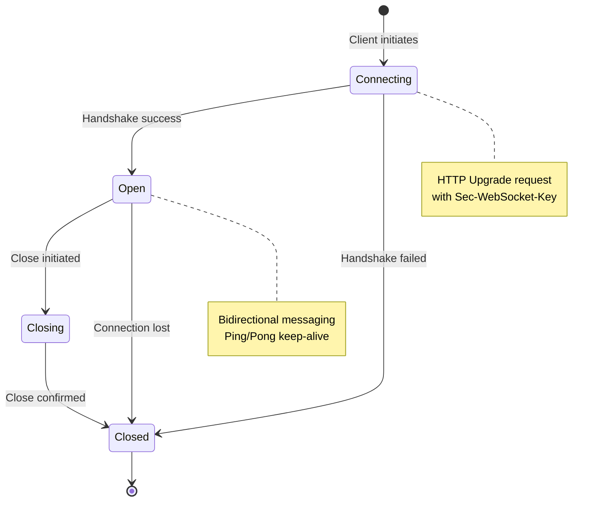
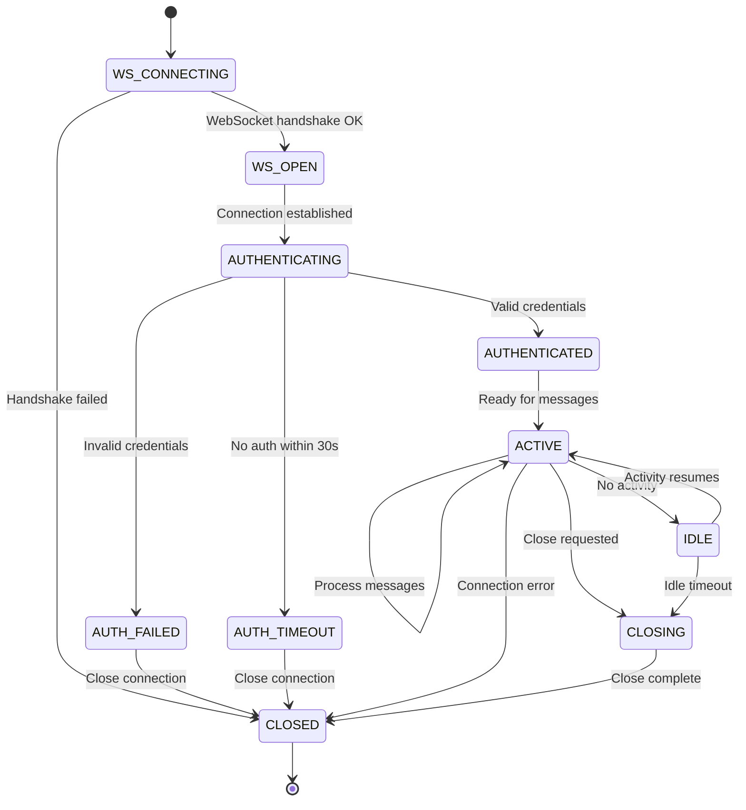
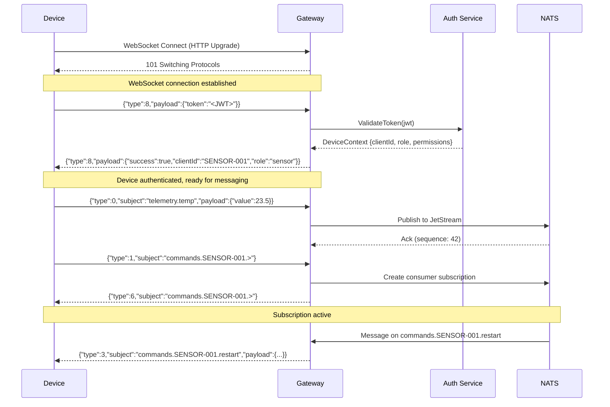
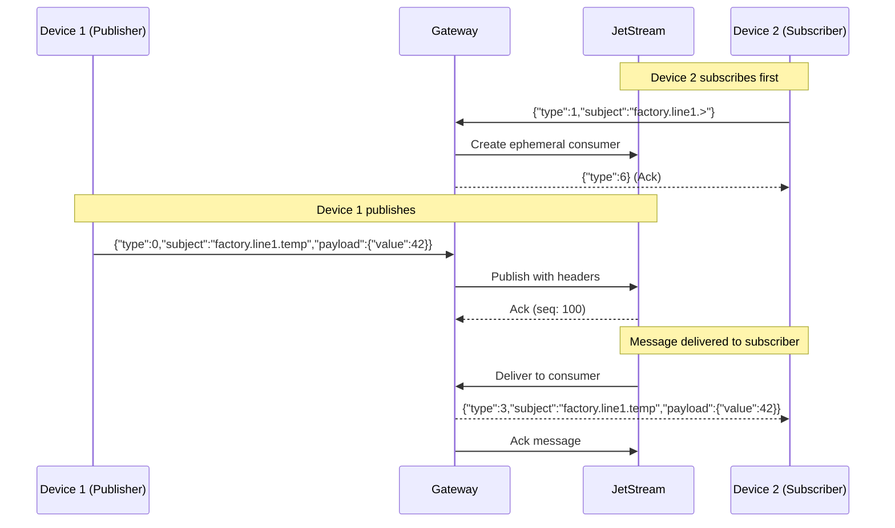

# WebSocket Protocol Developer Tutorial

A comprehensive guide for software engineers familiar with TCP/IP and REST APIs who want to understand WebSocket development in the context of this gateway.

## Table of Contents

1. [WebSocket vs REST: Mental Model Shift](#websocket-vs-rest-mental-model-shift)
2. [WebSocket Connection Lifecycle](#websocket-connection-lifecycle)
3. [Protocol Design](#protocol-design)
4. [Staged Development Approach](#staged-development-approach)
5. [Interactive Testing](#interactive-testing)
6. [Unit Testing WebSockets](#unit-testing-websockets)
7. [Common Pitfalls](#common-pitfalls)

---

## WebSocket vs REST: Mental Model Shift

If you're coming from REST APIs, here's the key paradigm shift:

| Aspect | REST API | WebSocket |
|--------|----------|-----------|
| Connection | New connection per request | Single persistent connection |
| Direction | Client initiates, server responds | Bidirectional, either can send |
| State | Stateless (auth per request) | Stateful (auth once, session persists) |
| Overhead | HTTP headers on every request | Initial handshake only |
| Real-time | Polling required | Native push capability |

### TCP/IP Analogy

Think of WebSocket as a higher-level abstraction over TCP:

```
TCP Socket:
  connect() → send(bytes) → recv(bytes) → close()

WebSocket:
  HTTP Upgrade → send(message) → onmessage(message) → close()
```

WebSocket adds:
- **Framing** - Messages are discrete units, not byte streams
- **Text/Binary modes** - Built-in encoding awareness
- **Ping/Pong** - Keep-alive at protocol level
- **Close handshake** - Graceful termination with reason codes

---

## WebSocket Connection Lifecycle

### State Diagram



### Gateway-Specific State Machine

Our gateway adds an authentication layer on top of the WebSocket protocol:



---

## Protocol Design

### Message Envelope

Every message follows this JSON structure:

```json
{
  "type": 0,
  "subject": "telemetry.sensor.temp",
  "payload": { ... },
  "correlationId": "optional-tracking-id",
  "timestamp": "2024-01-15T10:30:00Z",
  "deviceId": "set-by-gateway"
}
```

### Message Types (Enum)

| Type | Name | Direction | Description |
|------|------|-----------|-------------|
| 0 | Publish | Client → Server | Send data to NATS subject |
| 1 | Subscribe | Client → Server | Subscribe to NATS subject |
| 2 | Unsubscribe | Client → Server | Unsubscribe from subject |
| 3 | Message | Server → Client | Incoming message from subscription |
| 4 | Request | Client → Server | Request/reply pattern |
| 5 | Reply | Server → Client | Response to request |
| 6 | Ack | Server → Client | Acknowledgment |
| 7 | Error | Server → Client | Error notification |
| 8 | Auth | Bidirectional | Authentication |
| 9 | Ping | Client → Server | Keep-alive ping |
| 10 | Pong | Server → Client | Keep-alive response |

### Authentication Sequence



### Publish/Subscribe Flow



---

## Staged Development Approach

### Stage 1: Basic WebSocket Echo Server

Start with the simplest possible WebSocket server to understand the fundamentals.

```csharp
// Minimal WebSocket handler
app.Map("/ws", async (HttpContext context) =>
{
    if (!context.WebSockets.IsWebSocketRequest)
    {
        context.Response.StatusCode = 400;
        return;
    }

    var webSocket = await context.WebSockets.AcceptWebSocketAsync();
    var buffer = new byte[4096];

    while (webSocket.State == WebSocketState.Open)
    {
        var result = await webSocket.ReceiveAsync(buffer, CancellationToken.None);

        if (result.MessageType == WebSocketMessageType.Close)
            break;

        // Echo back
        await webSocket.SendAsync(
            buffer[..result.Count],
            result.MessageType,
            result.EndOfMessage,
            CancellationToken.None);
    }

    await webSocket.CloseAsync(
        WebSocketCloseStatus.NormalClosure,
        "Goodbye",
        CancellationToken.None);
});
```

**Test with:**
```bash
wscat -c ws://localhost:5000/ws
> hello
< hello
```

### Stage 2: Add Message Parsing

Add JSON message parsing with type routing:

```csharp
public async Task HandleMessageAsync(WebSocket socket, CancellationToken ct)
{
    var buffer = new byte[4096];
    var result = await socket.ReceiveAsync(buffer, ct);

    var json = Encoding.UTF8.GetString(buffer, 0, result.Count);
    var message = JsonSerializer.Deserialize<GatewayMessage>(json);

    switch (message.Type)
    {
        case MessageType.Ping:
            await SendPongAsync(socket, ct);
            break;
        case MessageType.Publish:
            // Next stage
            break;
        default:
            await SendErrorAsync(socket, "Unknown message type", ct);
            break;
    }
}
```

**Test with:**
```bash
wscat -c ws://localhost:5000/ws
> {"type":9}
< {"type":10,"timestamp":"..."}
```

### Stage 3: Add JWT Authentication

Implement JWT-based authentication before allowing other message types:

```csharp
public async Task<DeviceContext?> AuthenticateAsync(WebSocket socket, CancellationToken ct)
{
    using var cts = CancellationTokenSource.CreateLinkedTokenSource(ct);
    cts.CancelAfter(TimeSpan.FromSeconds(30)); // Auth timeout

    var buffer = new byte[4096];
    var result = await socket.ReceiveAsync(buffer, cts.Token);

    var message = ParseMessage(buffer, result.Count);

    if (message.Type != MessageType.Auth)
    {
        await SendErrorAsync(socket, "Expected AUTH message", ct);
        return null;
    }

    // Extract JWT token from payload
    var token = message.Payload?.GetProperty("token").GetString();
    var authResult = _jwtAuthService.ValidateToken(token);

    await SendAuthResponseAsync(socket, authResult, ct);

    return authResult.IsSuccess ? authResult.Context : null;
}
```

**Test with:**
```bash
wscat -c ws://localhost:5000/ws
> {"type":8,"payload":{"token":"eyJhbGciOiJIUzI1NiIs..."}}
< {"type":8,"payload":{"success":true,"clientId":"demo-device","role":"sensor"}}
```

### Stage 4: Add NATS Integration

Connect authenticated messages to NATS:

```csharp
private async Task HandlePublishAsync(
    DeviceContext context,
    GatewayMessage message,
    CancellationToken ct)
{
    // Authorization check using JWT permissions
    if (!_jwtAuthService.CanPublish(context, message.Subject))
    {
        await SendErrorAsync("Not authorized to publish");
        return;
    }

    // Add metadata
    message.DeviceId = context.ClientId;
    message.Timestamp = DateTime.UtcNow;

    // Publish to NATS JetStream
    var result = await _jetStreamService.PublishAsync(
        message.Subject,
        SerializeMessage(message),
        ct);

    if (!result.Success)
    {
        await SendErrorAsync(result.Error);
    }
}
```

### Stage 5: Add Subscriptions

Implement bidirectional message flow:

```csharp
private async Task HandleSubscribeAsync(
    DeviceContext context,
    GatewayMessage message,
    ConcurrentDictionary<string, string> subscriptions,
    CancellationToken ct)
{
    if (!_jwtAuthService.CanSubscribe(context, message.Subject))
    {
        await SendErrorAsync("Not authorized to subscribe");
        return;
    }

    var subscription = await _jetStreamService.SubscribeDeviceAsync(
        context.ClientId,
        message.Subject,
        async (msg) =>
        {
            // Forward NATS message to WebSocket
            var wsMessage = new GatewayMessage
            {
                Type = MessageType.Message,
                Subject = msg.Subject,
                Payload = msg.Data
            };
            _bufferService.Enqueue(context.ClientId, wsMessage);
            await _jetStreamService.AckMessageAsync(msg);
        },
        ct);

    subscriptions[message.Subject] = subscription.SubscriptionId;
    await SendAckAsync(message.Subject);
}
```

---

## Interactive Testing

### Tool: wscat

Install and use for quick testing:

```bash
# Install
npm install -g wscat

# First, generate a JWT token (gateway must be running in Development mode)
TOKEN=$(curl -s -X POST http://localhost:5000/dev/token \
  -H "Content-Type: application/json" \
  -d '{"clientId":"demo-device","publish":["telemetry.>"],"subscribe":["commands.demo-device.>"]}' \
  | jq -r '.token')

# Connect
wscat -c ws://localhost:5000/ws

# Send messages (paste these one at a time)
# Replace <TOKEN> with your generated token
{"type":8,"payload":{"token":"<TOKEN>"}}
{"type":0,"subject":"telemetry.demo-device.temp","payload":{"value":23.5}}
{"type":1,"subject":"commands.demo-device.>"}
{"type":9}
```

### Tool: websocat

More powerful alternative:

```bash
# Install
brew install websocat

# Connect with auto-reconnect
websocat -t ws://localhost:5000/ws

# Connect and send from file
cat messages.jsonl | websocat ws://localhost:5000/ws
```

### Tool: Browser DevTools

```javascript
// First get a token via: curl -X POST http://localhost:5000/dev/token -d '{"clientId":"browser-test"}'
const TOKEN = '<paste your token here>';

// Open browser console
const ws = new WebSocket('ws://localhost:5000/ws');

ws.onopen = () => {
    console.log('Connected');
    ws.send(JSON.stringify({
        type: 8,
        payload: { token: TOKEN }
    }));
};

ws.onmessage = (event) => {
    console.log('Received:', JSON.parse(event.data));
};

ws.onerror = (error) => console.error('Error:', error);
ws.onclose = (event) => console.log('Closed:', event.code, event.reason);

// Send messages (after auth succeeds)
ws.send(JSON.stringify({type: 9})); // Ping
ws.send(JSON.stringify({type: 0, subject: 'test.data', payload: {value: 42}}));
```

### Monitoring NATS Traffic

```bash
# Terminal 1: Subscribe to all NATS messages
nats sub ">"

# Terminal 2: Generate token and connect via WebSocket
TOKEN=$(curl -s -X POST http://localhost:5000/dev/token -d '{"clientId":"demo-device"}' | jq -r '.token')
wscat -c ws://localhost:5000/ws
> {"type":8,"payload":{"token":"<TOKEN>"}}
> {"type":0,"subject":"telemetry.demo-device.test","payload":{"hello":"world"}}

# Watch Terminal 1 for the message
```

### Testing Subscriptions End-to-End

```bash
# Terminal 1: Generate token and connect WebSocket
TOKEN=$(curl -s -X POST http://localhost:5000/dev/token \
  -d '{"clientId":"demo-device","subscribe":["commands.demo-device.>"]}' | jq -r '.token')
wscat -c ws://localhost:5000/ws
> {"type":8,"payload":{"token":"<TOKEN>"}}
> {"type":1,"subject":"commands.demo-device.>"}

# Terminal 2: Publish via NATS CLI
nats pub commands.demo-device.restart '{"action":"restart"}'

# Watch Terminal 1 for incoming message (type 3)
```

---

## Unit Testing WebSockets

This repository includes unit tests for WebSocket-related services. Here's how they're structured:

### Existing Test Coverage

The tests use **NUnit** and **Moq** for mocking:

```
tests/NatsWebSocketBridge.Tests/
├── DeviceConnectionManagerTests.cs      # Connection tracking
├── JwtDeviceAuthServiceTests.cs         # JWT validation & permissions
├── MessageValidationServiceTests.cs     # Message format validation
├── MessageBufferServiceTests.cs         # Outbound message buffering
└── TokenBucketThrottlingServiceTests.cs # Rate limiting
```

### Testing Strategy: Mock the WebSocket

The key insight is that you **don't test the WebSocket itself** - you mock it and test your handlers:

```csharp
// From DeviceConnectionManagerTests.cs
private static WebSocket CreateMockWebSocket()
{
    var mock = new Mock<WebSocket>();
    mock.Setup(x => x.State).Returns(WebSocketState.Open);
    return mock.Object;
}

[Test]
public void RegisterConnection_AddsDevice()
{
    // Arrange
    var device = CreateDevice("device-001");
    var webSocket = CreateMockWebSocket();

    // Act
    _connectionManager.RegisterConnection("device-001", device, webSocket);

    // Assert
    Assert.That(_connectionManager.ConnectionCount, Is.EqualTo(1));
    Assert.That(_connectionManager.IsConnected("device-001"), Is.True);
}
```

### Testing Message Validation

Test your message parsing and validation logic separately:

```csharp
// From MessageValidationServiceTests.cs
[Test]
public void Validate_ValidPublishMessage_ReturnsSuccess()
{
    var message = new GatewayMessage
    {
        Type = MessageType.Publish,
        Subject = "devices.sensor-001.data",
        Payload = new { temperature = 25.5 }
    };

    var result = _validationService.Validate(message);

    Assert.That(result.IsValid, Is.True);
}

[Test]
public void Validate_MissingSubject_ReturnsFailure()
{
    var message = new GatewayMessage
    {
        Type = MessageType.Publish,
        Subject = "",
        Payload = new { data = "test" }
    };

    var result = _validationService.Validate(message);

    Assert.That(result.IsValid, Is.False);
    Assert.That(result.ErrorMessage, Is.EqualTo("Subject is required"));
}
```

### Integration Testing with TestServer

For end-to-end WebSocket tests, use ASP.NET Core's TestServer:

```csharp
public class WebSocketIntegrationTests : IAsyncLifetime
{
    private WebApplicationFactory<Program> _factory;
    private HttpClient _client;

    public async Task InitializeAsync()
    {
        _factory = new WebApplicationFactory<Program>();
        _client = _factory.CreateClient();
    }

    [Fact]
    public async Task WebSocket_AuthenticateAndPublish_Succeeds()
    {
        // Create WebSocket client
        var wsClient = _factory.Server.CreateWebSocketClient();
        var ws = await wsClient.ConnectAsync(
            new Uri("ws://localhost/ws"),
            CancellationToken.None);

        // Send auth with JWT token
        // In real tests, generate a valid token using JwtDeviceAuthService.GenerateToken()
        await SendMessageAsync(ws, new GatewayMessage
        {
            Type = MessageType.Auth,
            Payload = new { token = "<valid-jwt-token>" }
        });

        // Receive auth response
        var response = await ReceiveMessageAsync(ws);
        Assert.Equal(MessageType.Auth, response.Type);

        // Verify success in payload
        var payload = JsonSerializer.Deserialize<AuthResponse>(
            response.Payload.ToString());
        Assert.True(payload.Success);

        await ws.CloseAsync(
            WebSocketCloseStatus.NormalClosure,
            "Done",
            CancellationToken.None);
    }

    private async Task SendMessageAsync(WebSocket ws, GatewayMessage msg)
    {
        var json = JsonSerializer.Serialize(msg);
        var bytes = Encoding.UTF8.GetBytes(json);
        await ws.SendAsync(bytes, WebSocketMessageType.Text, true, CancellationToken.None);
    }

    private async Task<GatewayMessage> ReceiveMessageAsync(WebSocket ws)
    {
        var buffer = new byte[4096];
        var result = await ws.ReceiveAsync(buffer, CancellationToken.None);
        var json = Encoding.UTF8.GetString(buffer, 0, result.Count);
        return JsonSerializer.Deserialize<GatewayMessage>(json);
    }

    public async Task DisposeAsync()
    {
        _client?.Dispose();
        await _factory.DisposeAsync();
    }
}
```

### Running the Tests

```bash
# Run all tests
cd tests/NatsWebSocketBridge.Tests
dotnet test

# Run with verbose output
dotnet test --logger "console;verbosity=detailed"

# Run specific test class
dotnet test --filter "FullyQualifiedName~MessageValidationServiceTests"

# Run with coverage
dotnet test --collect:"XPlat Code Coverage"
```

---

## Common Pitfalls

### 1. Forgetting WebSocket is Stateful

**Wrong:** Treating each message like a REST request
```csharp
// BAD: Re-authenticating on every message
async Task HandleMessage(WebSocket ws, GatewayMessage msg)
{
    var auth = await Authenticate(msg); // Don't do this!
    ...
}
```

**Right:** Authenticate once, track state
```csharp
// GOOD: Auth once, store device info
var device = await AuthenticateOnce(ws);
while (ws.State == WebSocketState.Open)
{
    var msg = await ReceiveMessage(ws);
    await HandleMessage(device, msg); // Use stored auth
}
```

### 2. Not Handling Partial Messages

WebSocket messages can be fragmented:

```csharp
// BAD: Assumes complete message
var result = await ws.ReceiveAsync(buffer, ct);
var message = Deserialize(buffer[..result.Count]);

// GOOD: Handle fragmentation
var messageBuilder = new List<byte>();
WebSocketReceiveResult result;
do
{
    result = await ws.ReceiveAsync(buffer, ct);
    messageBuilder.AddRange(buffer.Take(result.Count));
} while (!result.EndOfMessage);

var message = Deserialize(messageBuilder.ToArray());
```

### 3. Blocking the Receive Loop

**Wrong:** Processing in the receive loop
```csharp
// BAD: Slow processing blocks receiving
while (ws.State == WebSocketState.Open)
{
    var msg = await ReceiveAsync(ws);
    await SlowDatabaseOperation(msg); // Blocks!
}
```

**Right:** Decouple receiving from processing
```csharp
// GOOD: Use channels for backpressure
var channel = Channel.CreateBounded<GatewayMessage>(100);

// Receive task
_ = Task.Run(async () => {
    while (ws.State == WebSocketState.Open)
    {
        var msg = await ReceiveAsync(ws);
        await channel.Writer.WriteAsync(msg);
    }
});

// Process task
await foreach (var msg in channel.Reader.ReadAllAsync())
{
    await ProcessMessageAsync(msg);
}
```

### 4. Not Handling Connection Closure Properly

```csharp
// BAD: Ignoring close messages
var result = await ws.ReceiveAsync(buffer, ct);
var msg = Deserialize(buffer); // Crashes if close message!

// GOOD: Check message type
var result = await ws.ReceiveAsync(buffer, ct);
if (result.MessageType == WebSocketMessageType.Close)
{
    await ws.CloseAsync(
        WebSocketCloseStatus.NormalClosure,
        "Acknowledged",
        ct);
    break;
}
```

### 5. Resource Leaks on Disconnect

```csharp
// BAD: Resources leaked on error
try
{
    var subscription = await Subscribe(subject);
    await ProcessMessages(ws);
}
catch (Exception) { } // Subscription leaked!

// GOOD: Always cleanup
var subscriptions = new List<string>();
try
{
    var sub = await Subscribe(subject);
    subscriptions.Add(sub.Id);
    await ProcessMessages(ws);
}
finally
{
    foreach (var subId in subscriptions)
    {
        await Unsubscribe(subId);
    }
}
```

---

## Quick Reference

### Message Format Cheat Sheet

```json
// Auth (with JWT token)
{"type":8,"payload":{"token":"eyJhbGciOiJIUzI1NiIs..."}}

// Auth Response (success)
{"type":8,"payload":{"success":true,"clientId":"xxx","role":"sensor"}}

// Publish
{"type":0,"subject":"topic.name","payload":{...}}

// Subscribe
{"type":1,"subject":"topic.pattern.>"}

// Unsubscribe
{"type":2,"subject":"topic.pattern.>"}

// Ping
{"type":9}

// Error Response
{"type":7,"payload":{"error":"message"}}
```

### Generating Test Tokens

```bash
# In Development mode, use the /dev/token endpoint:

# Full access token
curl -X POST http://localhost:5000/dev/token \
  -d '{"clientId":"demo-device"}'

# Sensor with limited permissions
curl -X POST http://localhost:5000/dev/token \
  -d '{"clientId":"SENSOR-001","role":"sensor","publish":["telemetry.SENSOR-001.>"],"subscribe":["commands.SENSOR-001.>"]}'

# Token with custom expiry (2 hours)
curl -X POST http://localhost:5000/dev/token \
  -d '{"clientId":"short-lived","expiryHours":2}'
```

### WebSocket Close Codes

| Code | Meaning |
|------|---------|
| 1000 | Normal closure |
| 1001 | Going away (server shutdown) |
| 1002 | Protocol error |
| 1003 | Unsupported data |
| 1008 | Policy violation (auth failed) |
| 1011 | Unexpected condition |

---

## Further Reading

- [RFC 6455 - The WebSocket Protocol](https://tools.ietf.org/html/rfc6455)
- [ASP.NET Core WebSockets](https://docs.microsoft.com/en-us/aspnet/core/fundamentals/websockets)
- [NATS JetStream Documentation](https://docs.nats.io/nats-concepts/jetstream)
- [System.Threading.Channels](https://docs.microsoft.com/en-us/dotnet/core/extensions/channels)
